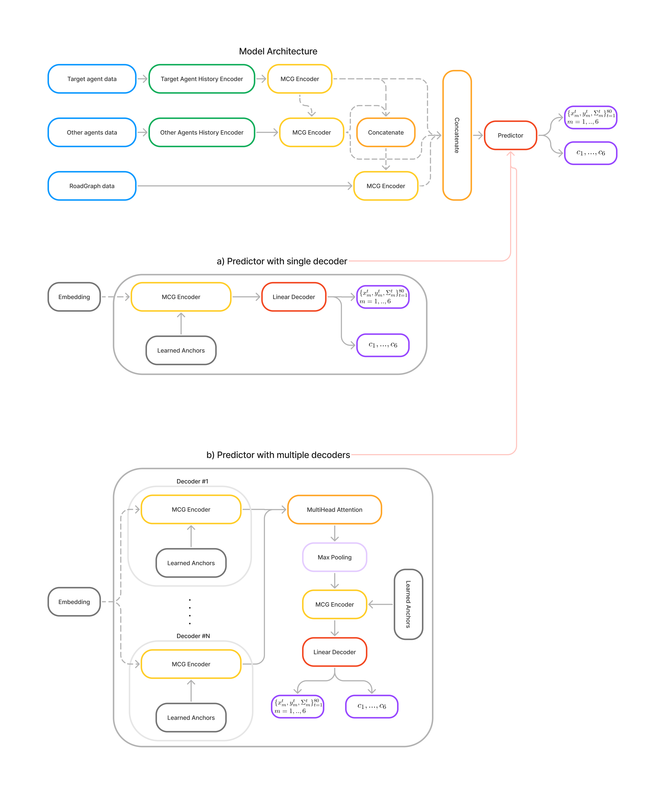

# Waymo motion prediction challenge 2022: 3rd place solution (May, 26)
## Our implementation of [MultiPath++](https://arxiv.org/abs/2111.14973)




## General Info:
- 🏎️[**CVPR2022 Workshop on Autonomous Driving website**](https://cvpr2022.wad.vision)
- 📜[**Technical report**](https://arxiv.org/abs/2206.10041)   
- 🥉[**Waymo Motion Prediction Challenge Website**](https://waymo.com/open/challenges/2022/motion-prediction/)
- [❗Refactored code for our prize-winnig solution for Waymo Motion Prediction Challenge 2021](https://github.com/stepankonev/MotionCNN-Waymo-Open-Motion-Dataset)

## Team behind this solution:
Stepan Konev 
- [[LinkedIn]](https://www.linkedin.com/in/stepan-konev/)
- [[Twitter]](https://twitter.com/konevsteven)
- [[Facebook]](https://www.facebook.com/stepan.konev.31)

## Code Usage:
First we need to prepare data for training. The prerender script will convert the original data format into set of ```.npz``` files each containing the data for a single target agent. From ```code``` folder run
```
python3 prerender/prerender.py \
    --data-path /path/to/original/data \
    --output-path /output/path/to/prerendered/data \
    --n-jobs 24 \
    --n-shards 1 \
    --shard-id 0 \
    --config configs/prerender.yaml
```
Rendering is a memory consuming procedure so you may want to use ```n-shards > 1``` and running the script a few times using consecutive ```shard-id``` values

Once we have our data prepared we can run the training.
```
python3 train.py configs/final_RoP_Cov_Single.yaml
```

If you find this work interesting please ⭐️star and share this repo.

## Citation
If you find this work useful please cite us
```
@misc{https://doi.org/10.48550/arxiv.2206.10041,
  doi = {10.48550/ARXIV.2206.10041},
  url = {https://arxiv.org/abs/2206.10041},
  author = {Konev, Stepan},
  keywords = {Computer Vision and Pattern Recognition (cs.CV), FOS: Computer and information sciences, FOS: Computer and information sciences},
  title = {MPA: MultiPath++ Based Architecture for Motion Prediction},
  publisher = {arXiv},
  year = {2022},
  copyright = {arXiv.org perpetual, non-exclusive license}
}

```
